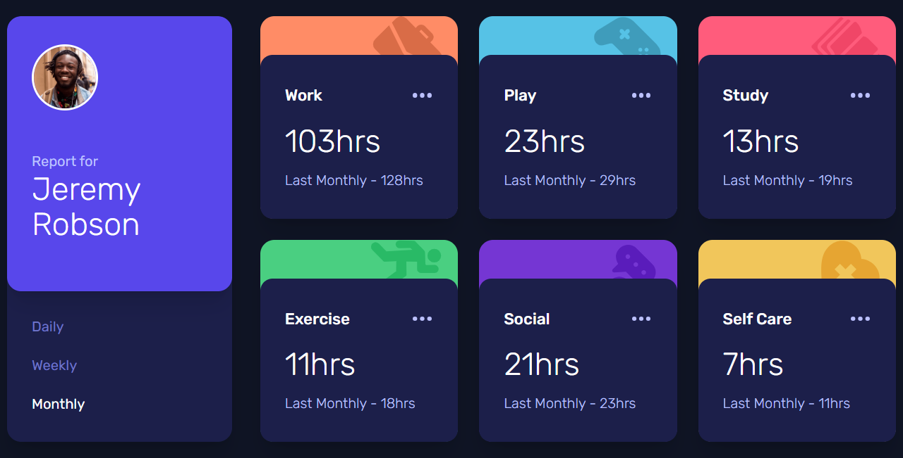

<div align="center">

  

  <h2>Time tracking dashboard</h2>

  <h3>
    <a href="https://www.frontendmentor.io/solutions/todo-app-Xd2XKWu4p2">
      <strong>Frontend Mentor</strong>
    </a>
  </h3>

  <br>

  <div align="center">
    <a href="">View Demo</a>
    -
    <a href="">Report Bug</a>
    -
    <a href="">Request Feature</a>
  </div>

</div>

#

<div align="center">


</div>

This is a solution to the [Time tracking dashboard challenge on Frontend Mentor](https://www.frontendmentor.io/challenges/time-tracking-dashboard-UIQ7167Jw). Frontend Mentor challenges help you improve your coding skills by building realistic projects.

<h2>Links</h2>

- Solution URL: [Time tracking dashboard | Frontend Mentor]()
- Live Site URL: []()

<br>

## Table of contents

- [](#)
  - [Table of contents](#table-of-contents)
  - [Overview](#overview)
    - [The challenge](#the-challenge)
    - [Screenshot](#screenshot)
  - [My process](#my-process)
    - [Built with](#built-with)
  - [Useful resources](#useful-resources)
  - [Author](#author)
  - [Run the project](#run-the-project)

## Overview

### The challenge

Users should be able to:

- View the optimal layout for the site depending on their device's screen size
- See hover states for all interactive elements on the page
- Switch between viewing Daily, Weekly, and Monthly stats

### Screenshot



## My process

### Built with

- Semantic HTML5 markup
- Mobile-first workflow
- [React](https://reactjs.org/) - JS library
- [Next.js](https://nextjs.org/) - React framework
- [Tailwind CSS](https://tailwindcss.com/) - For styles

## Useful resources

- [Tailwind CSS](https://tailwindcss.com/)
- [React](https://reactjs.org/)
- [Next.js](https://nextjs.org/)

## Author

- Frontend Mentor - [@JenaCarry](https://www.frontendmentor.io/profile/JenaCarry)
- LinkedIn - [Jean Dias](https://www.linkedin.com/in/jean-dias-0900a1260/)

## Run the project

To run the client, you need to run the following command:

```bash
npm install
npm run dev
# or
yarn dev
# or
pnpm dev
```

Open [http://localhost:3000](http://localhost:3000) with your browser to see the result.
